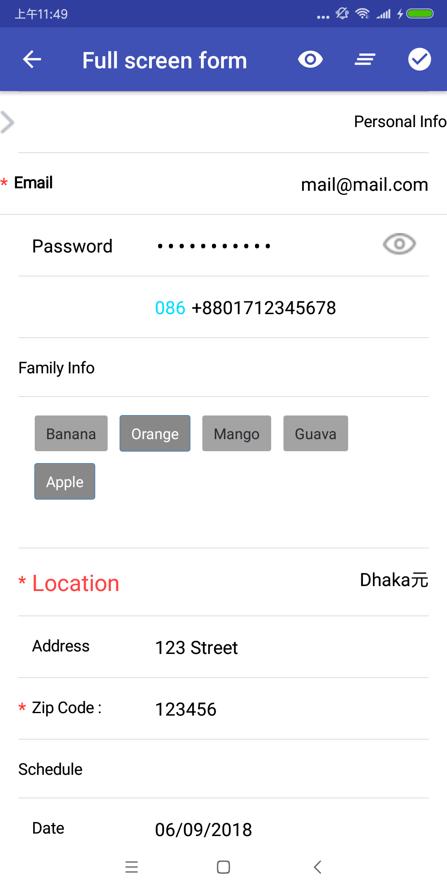

基于 [KFormMaster](https://github.com/thejuki/KFormMaster)扩展的版本，增加了一些参数和控件

表单控件的设置目标是将常用的表单输入方式封装起来，通过简单的代码设置即可完成表单的title，输入框，日期，数字等输入验证

目前控件支持kotlin DSL风格的语法即可完成以前layout.xml的工作，表单页面使用recycleview呈现，支持滚动表单，分隔线等操作

## Examples


目前已经实现的功能

1，免写xml控件，不需要写findviewbyid,不需要butterknife

2，支持字符输入，是否必填，是否添加必填星号

3，数字输入小数点前后限制，最大值等限制

4，日期时间选择

5，标题和输入值添加前后缀的文字或者icon

6，整体布局和单独控件的padding调整

开发流程:

1,  在表单页面的layou.xml中添加recycleview，页面的其它部分和以前开发代码一样

    ```kotlin
        <android.support.v7.widget.RecyclerView
            android:id="@+id/owner_edit_equi_recycleview"
            android:layout_width="match_parent"
            android:layout_height="wrap_content"
            android:layout_below="@+id/first_use_tips" />
    ```

2,  创建ViewStub类，用来描述表单页面，相当于以前的layout.xml

声明控件是为了让其它类获得控件并操作，如果只是用于显示，不需要其它操作，可以不声明
    ```kotlin

    /**
     * ViewStub用来描述UI界面
     */
    open class EditEquipmentActivityStub {
        private lateinit var formBuilder: FormBuildHelper

        //给表单中每个控件赋值Tag，其实写不写都无所谓，因为下面会用声明变量的方式获得控件
        private enum class Tag {
            EquipmentInfo,
            ...
        }

        //通过声明变量的方式获得控件
        //如果不使用这种方式，也可以使用
        //formBuilder.getFormElement(Tag.EquipmentInfo.ordinal) as FormSingleLineEditTextElement
        lateinit var equiInfo: FormSingleLineEditTextElement
        ...
    }
    ```

3,  在setupForm方法中描述表单控件

    ```kotlin
        //设置表单的通用布局参数，支持PaddingLeft/Top/Right/Bottom，layoutMarginLeft/Top/Right/Bottom
            //这里设置的是通用参数，会作用在表单中的每个控件上，但是控件也可以设置自己的布局参数，控件自己的布局参数会覆盖通用参数
            formBuilder = form(activity, recyclerView, cacheForm = false, commonPaddingLeft = 4
                    , commonPaddingTop = 15, commonPaddingBottom = 15
                    , commonlayoutMarginRight = 13) {
                //这里的Tag设置不设置没什么影响
                equiInfo = text(Tag.EquipmentInfo.ordinal) {
                    title = activity.getString(R.string.device_info) //title: 控件标题显示文字
                    required = true //是否必填参数
                    requiredShowAsterisk = View.VISIBLE //是否显示前面的必填星号
                    hint = activity.getString(R.string.selected)   //hint文字
                    titleTextSize = 14  //title字体大小 ，单位是SP
                    titlesColor = R.color.c_6a6a77//title颜色
                    valueTextSize = 15//输入值的字体大小，单位SP
                    valueColor = R.color.c_4A4A53   //输入值的颜色
                    valueSuffixImage = R.mipmap.icon_right  //输入值后缀的icon
                    enabled = false //是否可编辑
                    showTopDivider = false  //是否显示上分隔线
                    valueOnClickListener = equiInfoClick//输入值的点击事件
                }
    ```

4,  在Activity或Fragment中调用setupForm方法生成界面，并通过stub.xxx获得控件并操作,这里传入的owner_edit_equi_recycleview，就是在layout.xml中recycleview的ID
    ```kotlin
    val stub = EditEquipmentActivityStub()
    stub.setupForm(this, owner_edit_equi_recycleview)

    stub.equiHourNum.value = entity!!.totalHours    //通过stub.xxx 获得控件并赋值
    ```

5,  目前支持的表单控件和参数详细列表

通用布局参数，会作用到表单中的每个控件上,单位DP

|通用布局参数|默认值|说明|
|---|---|---|
|commonPaddingLeft|0|通用布局的paddingLeft，如果给控件单独设置paddingLeft，会覆盖通用参数|
|commonPaddingTop|0|通用布局的PaddingTop，如果给控件单独设置PaddingTop，会覆盖通用参数|
|commonPaddingRight|0|通用布局的PaddingRight，如果给控件单独设置PaddingRight，会覆盖通用参数|
|commonPaddingBottom|0|通用布局的PaddingBottom，如果给控件单独设置PaddingBottom，会覆盖通用参数|
|commonlayoutMarginLeft|0|通用布局的layoutMarginLeft，如果给控件单独设置layoutMarginLeft，会覆盖通用参数|
|commonlayoutMarginTop|0|通用布局的layoutMarginTop，如果给控件单独设置layoutMarginTop，会覆盖通用参数|
|commonlayoutMarginRight|0|通用布局的layoutMarginRight，如果给控件单独设置layoutMarginRight，会覆盖通用参数|
|commonlayoutMarginBottom|0|通用布局的paddingLeft，如果给控件单独设置layoutMarginBottom，会覆盖通用参数|
|commonValueColor|未设置|布局中所有输入框的字体颜色，如果单独给输入框指定valueColor，会覆盖此参数|
|commonValueBold|false|表单中所有输入框字体是否粗体，如果单独给输入框指定valueBold，会覆盖此参数|
|commonValueTextSize|未设置|表单中所有输入框的字体大小|
|commonValuePrefixTextColor|未设置|表单中所有输入框前缀文字颜色|
|commonValuePrefixTextBold|false|表单中所有输入框的前缀文字是否粗体|
|commonValuePrefixTextSize|未设置|表单中所有输入框的前缀文字大小|
|commonValueSuffixColor|未设置|表单中所有输入框的后缀文字颜色|
|commonValueSuffixBold|false|表单中所有输入框的后缀文字是否粗体|
|commonValueSuffixSize|未设置|表单中所有输入框的后缀文字大小|
|commonHintColor|未设置|表单中所有输入框的hint字体颜色|
|commonTitleTextSize|未设置|表单中所有字段标题字体大小|
|commonTitlesColor|未设置|表单中所有字段标题字体颜色|
|commonTitleFocusColor|未设置|表单中所有字段标题获得焦点时的字体颜色|
|commonTitleBold|false|表单中所有字段标题是否粗体|
|commonRequiredShowAsterisk|false|表单中所有必填项是否显示前面的星号，false为不显示，true为显示|
|commonDividerPaddingLeft|0|表单中所有的上下分隔线左边距|
|commonDividerPaddingRight|0|表单中所有的上下分隔线右边距|
|commonDividerHeight|0.5|表单中所有的上下分隔线高度|
|commonDividerColor|#DDDDDD|表单中所有的上下分隔线颜色|
|commonLayoutBackground|#FFFFFF|表单中所有字段的背景颜色|

目前支持的控件

|创建时的类型|声明类型|说明|
|---|----|---|
|text|FormSingleLineEditTextElement|单行文字输入|
|textArea|FormMultiLineEditTextElement|多行文字输入|
|number|FormNumberEditTextElement|数字类型输入|
|email|FormEmailEditTextElement|email地址输入|
|password|FormPasswordEditTextElement|密码输入|
|phone|FormPhoneEditTextElement|电话号码输入|
|dateTime|FormPickerDateTimeElement|日期时间选择|
|tagGroup|FormPickerTagElement|tag选择|
|checkBox|FormCheckBoxElement|checkbox复选框|
|textView|FormTextViewElement|文字显示不可编辑|

|通用设置参数|类型|默认值|说明|
|---|---|---|---|
|value|String|null|输入框中的值|
|valueColor|R.color|null|输入框中的值显示颜色，不设置时默认通过主题控制|
|valueBold|boolean|false|输入框是否显示为粗体|
|valueTextSize|Int|null|输入框字体大小，单位SP|
|valuePrefixText|String|null|输入框前缀文字，用户不可更改|
|valuePrefixTextColor|R.color|null|输入框前缀文字的颜色|
|valuePrefixTextBold|boolean|false|输入框前缀文字是否粗体|
|valuePrefixTextSize|Int|null|输入框前缀文字大小，单位SP|
|valueSuffixText|String|null|输入框后缀文字，用户不可更改|
|valueSuffixColor|R.color|null|输入框后缀文字的颜色|
|valueSuffixBold|boolean|false|输入框后缀文字是否粗体|
|valueSuffixSize|Int|null|输入框后缀文字大小,单位SP|
|valueSuffixImage|R.drawable|null|输入框后缀icon|
|valueOnClickListener|View.OnClickListener|null|输入框点击后响应事件|
|hintColor|R.color|null|输入框hint的颜色|
|titlePrefixImage|R.drawable|null|标题的前缀icon|
|titleTextSize|Int|null|标题文字大小，单位SP|
|titlesColor|R.color|null|标题文字颜色|
|titleFocusColor|R.color|null|此控件获得焦点时标题变化的颜色，不设置时与titlesColor一样|
|titleDrawableLeft|R.drawable|null|标题左侧icon|
|titleDrawableRight|R.drawable|null|标题右侧icon|
|titleDrawablePadding|Int|null|标题icon间距|
|requiredShowAsterisk|Int|View.INVISIBLE|标题前是否显示必填星号|
|titleBold|Boolean|false|标题是否粗体|
|showColln|Boolean|false|是否在标题后面自动添加冒号|
|showTitleLayout|Int|View.VISIBLE|此控件的标题列是否显示|
|showValueLayout|Int|View.VISIBLE|此控件的输入值列是否显示|
|valueMaxLength|Int|-1，不限制|输入框最大文字长度|
|paddingLeft|Int|-1|此控件单独设置 paddingLeft，不设置时以通用布局参数为准|
|paddingTop|Int|-1|此控件单独设置 paddingTop，不设置时以通用布局参数为准|
|paddingRight|Int|-1|此控件单独设置 paddingRight，不设置时以通用布局参数为准|
|paddingBottom|Int|-1|此控件单独设置 paddingBottom，不设置时以通用布局参数为准|
|layoutMarginLeft|Int|-1|此控件单独设置 layoutMarginLeft，不设置时以通用布局参数为准|
|layoutMarginTop|Int|-1|此控件单独设置 layoutMarginTop，不设置时以通用布局参数为准|
|layoutMarginRight|Int|-1|此控件单独设置 layoutMarginRight，不设置时以通用布局参数为准|
|layoutMarginBottom|Int|-1|此控件单独设置 layoutMarginBottom，不设置时以通用布局参数为准|
|showTopDivider|Boolean|true|是否显示上分隔线|
|showBottomDivider|Boolean|false|是否显示下分隔线|
|selectAllOnFocus|Boolean|false|输入框获得焦点时是否全选状态|
|hint|String|null|输入框的hint值|
|rightToLeft|Boolean|false|输入框的文字是否右对齐|
|maxLines|Int|1|最大几行|
|required|Boolean|false|此控件是否必填|
|enabled|Boolean|true|此控件是否可用，当输入框为edittext时，不可用状态下，设置为不可编译但响应点击事件|
|dividerPaddingLeft|Int|0|上下分隔线左边距，单位DP|
|dividerPaddingRight|Int|0|上下分隔线右边距，单位DP|
|dividerHeight|Int|0.5|上下分隔线高度，单位DP|
|dividerColor|R.color|#DDDDDD|上下分隔线颜色|
|layoutBackground|R.color|#FFFFFF|控件背景颜色|
|valueObservers|||输入框值变化时的响应监听|

密码输入框的指定参数

|通用设置参数|类型|默认值|说明|
|---|---|---|---|
|showHidePasswordBtn|false|Boolean|是否显示 切换隐藏/显示密码密码的按钮|
|hidePasswordBtnRes|大眼睛那个|R.drawable|自定义切换隐藏/显示密码的按钮资源|

数字输入框的指定参数

|通用设置参数|类型|默认值|说明|
|---|---|---|---|
|numbersOnly|Boolean|true|是否只能输入数字|
|allowRadixPoint|Boolean|false|是否允许输入小数点|
|beforeRadixPointNum|Int|不限制|小数点前可以输入几位|
|afterRadixPontNum|Int|不限制|小数点后可以输入几位|
|maxValue|Int|不限制|可输入的数字最大值|

日期时间选择框的指定参数

|通用设置参数|类型|默认值|说明|
|---|---|---|---|
|dateFormat|DateFormat|时区默认|选择日期时间后在输入框显示的格式|
|dateValue|Calendar||默认的值，赋值后会显示在输入框中和选择日期时间的滚动轴中，选择日期时间后会对dataValue赋值|
|hasYear|Boolean|true|是否可以选择年|
|hasMonth|Boolean|true|是否可以选择月|
|hasDay|Boolean|true|是否可以选择日|
|hasHours|Boolean|true|是否可以选择小时|
|hasMins|Boolean|true|是否可以选择分钟|
|hasSeconds|Boolean|true|是否可以选择秒|
|startDate|Calendar|1900|选择滚动轴范围的起始时间|
|endDate|Calendar|1900|选择滚动轴范围的结束时间|

Tag选择器的指定参数

tag的选项必须实现com.uiiang.ktform.helper.BaseTag接口

实现接口中的getTagId，返回该tag的唯一ID，getTagText，返回该tag的显示文字

|通用设置参数|类型|默认值|说明|
|---|---|---|---|
|maxSelectedCount|Int|不限制|最多可以选择几个tag|
|selectedIdList|MutableList<Long>|空|默认已选的tagid|
|tagOptions|MutableList<BaseTag>|空|tag选项|
|tagLayoutRes|R.layout|null|自定义tag的显示样式|
